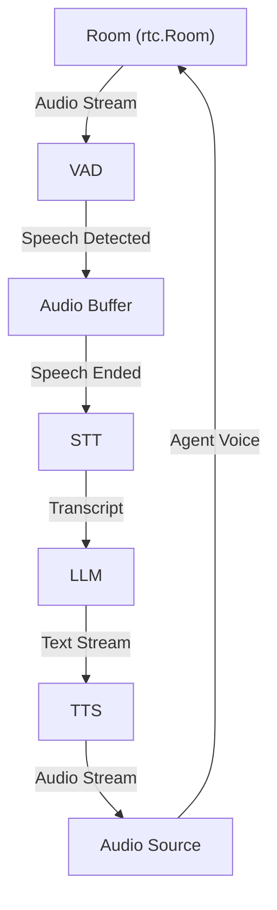
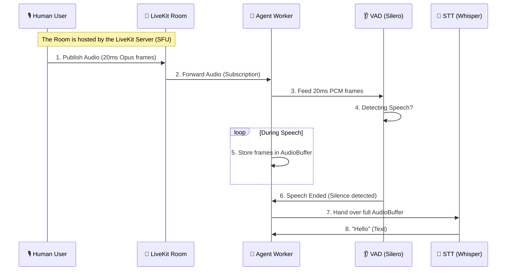
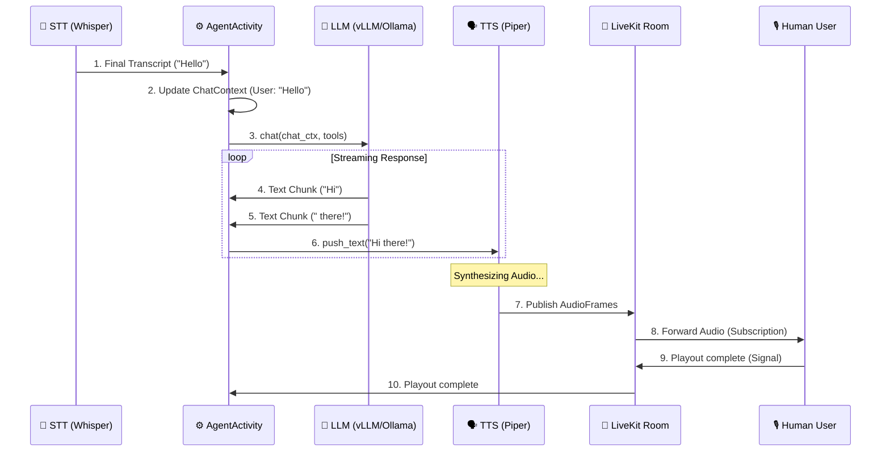

# LiveKit Voice Agent: Behind the Scenes

This guide explains how LiveKit's `AgentSession` coordinates multiple AI models (VAD, STT, LLM, TTS) into a seamless real-time voice experience.

## High-Level Architecture

The `AgentSession` acts as the "brain" or "orchestrator" of the voice agent. It manages the full lifecycle of a conversation by linking several components together:



### 🧠 Key Concepts: Server vs. Room
Before diving into the components, it’s crucial to understand two terms that are often used interchangeably:

> [!TIP]
> **LiveKit Server = The Building** (The physical software running on a machine). It provides the infrastructure to route data.
>
> **LiveKit Room = A Conference Room** (A logical space created inside the server). It is the specific context where participants interact.
>
> **Key Difference**: One **Server** can host thousands of **Rooms**. When the agent joins, it connects to a specific **Room** *on* a specific **Server**.

### 1. Voice Activity Detection (VAD)
**The Trigger**: VAD is always listening to the incoming audio track from the room.
- **How it works**: It looks for patterns in the audio energy consistent with human speech.
- **Behind the scenes**:
    - **Audio Path**: `AgentSession` runs a background task (`_forward_audio_task`) that continuously pulls raw audio frames from the participant's track.
    - **Parallel Processing**: These frames are pushed into two separate internal queues simultaneously: one for the **VAD** and one for the **STT**.
    - **VAD Decision**: The VAD model (like Silero) processes the stream and emits events (`START_OF_SPEECH`, `END_OF_SPEECH`).
    - **Buffering Control**: When VAD detects `START_OF_SPEECH`, the session enters a "speaking" state. It continues to collect audio in the STT buffer until VAD detects `END_OF_SPEECH` and the "endpointing delay" (silence threshold) has passed.
- **Implementation**: In your code, you use `silero.VAD.load()`, which is a highly efficient local VAD model.

### 2. Speech-to-Text (STT)
**The Translator**: Once the VAD identifies a complete utterance, the buffered audio is sent to the STT model.

#### 🛠️ Internal Step-by-Step:
1.  **Frame Collection**: While the user is speaking, LiveKit collects audio in **20ms chunks** (standard WebRTC frames). These are stored in an `AudioBuffer`.
2.  **Trigger**: As soon as the VAD detects silence (exceeding the `min_silence_duration`), it "vends" the entire collected buffer to the STT.
3.  **Normalization**: The [FasterWhisperSTT](file:///home/vrh3/workspace/projects/voice-agent/src/local_livekit_plugins/faster_whisper_stt.py#L133-L142) plugin converts the raw `int16` audio data (which ranges from -32768 to 32767) into `float32` values normalized between **[-1.0, 1.0]**.
4.  **Inference**: The normalized array is passed to the `faster-whisper` model.
    -   **Chunk Sizes**: Whisper models internally work on **30-second windows**. If your speech is shorter, it is padded; if longer, it is processed in overlapping blocks.
    -   **Beam Search**: The model explores multiple possible text paths (defined by `beam_size`) to find the most likely sentence.
5.  **Reconstruction**: The model returns "segments". The plugin joins these segments into a single string of text.
6.  **Handoff**: The text is wrapped in a `SpeechEvent` and sent to the LLM via the `ChatContext`.

#### 🚀 Local Integration:
- **[FasterWhisperSTT](file:///home/vrh3/workspace/projects/voice-agent/src/local_livekit_plugins/faster_whisper_stt.py)**: A custom-built local plugin for this project.
- **Why Faster-Whisper?**: It is an implementation of OpenAI's Whisper model using CTranslate2, which is up to **4x faster** than the original version and uses significantly less memory.

### 3. Large Language Model (LLM)
**The Intelligence**: The transcript from the STT is added to the conversation history (`ChatContext`) and sent to the LLM.
- **How it works**: The LLM processes the message and generates a response. To keep latency low, it usually **streams** its response word-by-word or sentence-by-sentence.
- **Implementation**: In the example, `lk_openai.LLM.with_ollama(...)` allows you to use a local model (via Ollama) using the standard OpenAI protocol.

### 4. Text-to-Speech (TTS)
**The Voice**: As the LLM generates text chunks, they are immediately fed into the TTS engine.
- **How it works**: The TTS converts the text back into audio.
- **Local Integration**:
    - **[PiperTTS](file:///home/vrh3/workspace/projects/voice-agent/src/local_livekit_plugins/piper_tts.py)**: This plugin creates a `_PiperChunkedStream`. It synthesizes audio for each text block provided by the LLM. It uses a thread pool to handle the synthesis without blocking the main event loop.
- **Real-Time Synergy**: LiveKit matches the timing of the TTS audio output with the room's clock to ensure a smooth, conversational feel.

---

## The "Magic" of `AgentSession`

What makes the LiveKit Agents SDK special is how it handles the **complex edge cases** that occur during real conversations:

### 🔇 Turn Detection & Endpointing
`AgentSession` doesn't just wait for the user to stop talking. It uses an **endpointing delay** (e.g., 500ms). If the user pauses for longer than this, it assumes they are finished. This prevents the agent from cutting the user off mid-sentence.

### ✋ Interruptions
If the user starts talking while the agent is still speaking, `AgentSession` detects this via the VAD.
- It immediately **stops** the agent's current audio playback.
- It **discards** any pending audio chunks in the TTS queue.
- It **cancels** the LLM generation task.
- This creates the natural experience where the agent stops immediately when you "talk over" it.

### 🔄 State Management
The session manages a state machine for both the user and the agent:
- `user_state`: `listening` ↔ `speaking`
- `agent_state`: `listening` ↔ `thinking` ↔ `speaking`

You can see this in [voice_agent.py](file:///home/vrh3/workspace/projects/voice-agent/examples/voice_agent.py#L215-L222), where latency is tracked by measuring the time between `user_input_transcribed` and `agent_state == "speaking"`.

---

## Code Highlight: The Setup in `voice_agent.py`

When you return the `AgentSession` object:

```python
return AgentSession(
    stt=FasterWhisperSTT(...),  # Custom local model
    llm=lk_openai.LLM(...),      # OpenAI-compatiable local LLM
    tts=PiperTTS(...),           # Custom local voice
    vad=silero.VAD.load(),       # Standard VAD plugin
)
```

You are essentially providing the session with its vital organs. The session itself provides the "nervous system" that makes them all work together automatically without you having to write the networking or audio synchronization code yourself.
---

## The Engine: Background Tasks

To provide a real-time experience, the system runs several asynchronous tasks in the background. Here is a breakdown of the most important ones:

### 🌐 Connection & Infrastructure
- **`_job_ctx_connect`**: The initial task that connects your agent worker to the LiveKit Server.
- **`_forward_audio_task`**: The high-level loop that constantly pulls audio frames from the room and feeds them into the system's "ears."
- **`_update_activity`**: Manages the transitions between different agent behaviors (e.g., if you have multiple agents in one session).

### ❤️ The Heart (AgentActivity)
- **`_scheduling_task`**: The "Main Loop" of your agent. It monitors the speech queue and decides when to transition between states: `listening` → `thinking` → `speaking`.
- **`_tts_task`**: Created every time the agent needs to speak. It handles the text synthesis (e.g., via Piper) and forwards the audio to the room.
- **`_on_enter_task` / `_on_exit_task`**: Lifecycle hooks that run your custom logic when an agent initializes or shuts down.

### 👂 The Senses (AudioRecognition)
- **`_vad_task`**: Continuously processes audio frames through the VAD model (Silero) to detect speech vs. silence.
- **`_stt_task`**: Manages the STT engine (FasterWhisper). It waits for the VAD's signal to know when to start and stop transcription.
- **`_end_of_turn_task`**: The "Patience" task. It waits for the 0.5s silence delay after speech stops to see if the user is truly finished or just pausing.

### 🔊 The "Last Mile" (RoomIO)
- **`_forward_audio`**: Sends the synthesized audio from the agent's TTS back into the room's participant track.
- **`_wait_for_playout`**: A delicate task that ensures the agent doesn't start thinking about its *next* response until the *current* audio has actually finished playing in the user's ears.

You can see these tasks being created in the [AgentSession](file:///home/vrh3/workspace/projects/voice-agent/.venv/lib/python3.12/site-packages/livekit/agents/voice/agent_session.py) and [AgentActivity](file:///home/vrh3/workspace/projects/voice-agent/.venv/lib/python3.12/site-packages/livekit/agents/voice/agent_activity.py) source files.
---

## The Brain: LLM Prompting & Tools

The LLM is the core decision-maker of your agent. Here is how it interacts with your code and the user:

### 📝 How is the model prompted?
The "Instruction" you provide during the `Agent` initialization is treated as the **System Prompt**.
- **Location**: In your `VoiceAssistant` class ([voice_agent.py:92-101](file:///home/vrh3/workspace/projects/voice-agent/examples/voice_agent.py#L92-L101)), the `instructions` argument is passed to the base `Agent` class.
- **Behind the scenes**: Under the hood, the SDK injects these instructions as the first message in the `ChatContext` with the role `system`.

### 📖 Does it handle conversation history?
**Yes, completely.**
- `AgentSession` maintains a `ChatContext` object that acts as a short-term memory.
- Every time the user speaks, their transcript is added as a `user` message.
- Every time the agent responds, its reply is added as an `assistant` message.
- This entire context is sent to the LLM on every turn, allowing it to remember what was said earlier (e.g., answering "What did I just say?").

### 🛠️ Does it handle tool calls?
**Yes, the SDK provides a robust framework for function calling.**
- **Integration**: You can define Python functions and pass them to the `Agent` or `AgentSession` in the `tools` list.
- **Execution**: If the LLM decides to use a tool, it emits a "tool call" chunk. The `AgentActivity` intercepts this, runs your Python function, captures the output, and automatically sends it back to the LLM to continue the response.
- **Example Flow**:
    1. User: "What's the weather in London?"
    2. LLM: `[Tool Call: get_weather(city="London")]`
    3. System: (Runs your local function) -> "Sunny, 20°C"
    4. LLM: "The weather in London is sunny and 20°C."

You can see how the instructions and history are managed in the [Agent](file:///home/vrh3/workspace/projects/voice-agent/.venv/lib/python3.12/site-packages/livekit/agents/voice/agent.py) and [AgentActivity](file:///home/vrh3/workspace/projects/voice-agent/.venv/lib/python3.12/site-packages/livekit/agents/voice/agent_activity.py) files.
---

## The Room: Communication Hub

If the `AgentSession` is the brain, the **Room (`rtc.Room`)** is the physical space where the conversation happens.

### 🏢 What is a Room?
A LiveKit Room is a real-time session that connects multiple users and bots together. It acts as the central router for all audio, video, and data.

### 👥 Key Concepts inside a Room
- **Participants**: Everyone in the room (including your Agent) is a `Participant`.
    - **Local Participant**: This is your Agent itself.
    - **Remote Participants**: These are the human users or other bots connected to the same room.
- **Tracks**: The actual streams of data.
    - **Audio Track**: What the VAD listens to and what the TTS publishes to.
    - **Video Track**: Used for vision-based agents or avatars.
- **Publications**: When a participant "shares" a track with the room, they **Publish** it. Your agent's TTS publishes an audio track so others can hear it.
- **Subscriptions**: To hear someone, you must **Subscribe** to their track. The `AgentSession` automatically subscribes to the users' audio tracks so it can "hear" them.

### 🔗 Relationship with AgentSession
The `AgentSession` is essentially a specialized LiveKit client that:
1. **Joins** a Room.
2. **Scans** for human participants.
3. **Subscribes** to their audio.
4. **Pipes** that audio into the VAD and STT.
5. **Generates** its own audio and **Publishes** it back into the same Room.

Without the Room, the Agent would be "locked in a dark box" with no way to receive input or send output.

---

## The Senses: Silero VAD

**Silero VAD** is the "ears" of your agent that distinguish between speech and background noise.

### 🧠 What is Silero VAD?
Silero is a pre-trained, high-performance Voice Activity Detection (VAD) model. In this project, it runs locally using the **ONNX Runtime**, making it extremely fast and private.

### ⚙️ How it works
The VAD doesn't "understand" words; it only calculates the **probability** that a chunk of audio contains human speech.
- **Windowing**: It processes audio in small windows (usually 32ms).
- **Probability**: For each window, it outputs a value between 0.0 and 1.0.
- **State Machine**: It uses several buffers and thresholds to decide when someone has *started* and *stopped* speaking.

### 🛠️ Key Parameters (Tweaking Performance)
You can find these in the `silero.VAD.load()` call:
- **`activation_threshold` (default 0.5)**: If the model is >50% sure it's speech, it marks it as active.
- **`min_speech_duration` (default 0.05s)**: Prevents accidental triggers from very short noises (like a cough or a click).
- **`min_silence_duration` (default 0.55s)**: How long the user must be silent before the VAD says "they stopped speaking."
- **`prefix_padding_duration` (default 0.5s)**: One of the most important settings. It keeps a "pre-roll" buffer of audio so that when speech is detected, the *beginning* of the sentence isn't cut off.

### 🖥️ CPU vs GPU
By default, Silero VAD in this project **uses the CPU** (`force_cpu=True`).

**Why not the GPU?**
- **Data Transfer Overhead**: Silero is a very "light" model. The time it takes to move audio data from your system RAM to the GPU's VRAM (and back) is often greater than the time it takes the CPU to just run the calculation.
- **Latency**: For real-time voice, every millisecond counts. Running VAD on the CPU eliminates the bus latency associated with the GPU.
- **Efficiency**: It saves your GPU's power and memory for much heavier tasks, like running the LLM (Ollama/vLLM) or a vision model.

You can see this logic in [onnx_model.py:43-49](file:///home/vrh3/workspace/projects/voice-agent/.venv/lib/python3.12/site-packages/livekit/plugins/silero/onnx_model.py#L43-L49).

### 🚀 Why Silero?
- **Local & Private**: No audio leaves your server for voice detection.
- **Efficiency**: It is much lighter than running a full STT model (like Whisper) continuously.
- **Robustness**: It is specifically trained to handle various backgrounds, accents, and languages.

You can dive deeper into the implementation in the [silero/vad.py](file:///home/vrh3/workspace/projects/voice-agent/.venv/lib/python3.12/site-packages/livekit/plugins/silero/vad.py) source file.

---

## RTC: The Infrastructure

While the `livekit.agents` package handles the "AI logic," the **`livekit.rtc`** package handles the "networking and media."

### 🔌 What is RTC?
**RTC** stands for **Real-Time Communication**. It is the technology that allows audio and video to travel across the internet with almost zero delay (less than 200ms).

### 🛠️ What does the RTC layer do?
Think of the RTC layer as the **"Broadcasting Station"** and the **"Wire"**:
- **Connection Management**: It handles the complexities of WebRTC (ICE, STUN, TURN) to make sure your agent can connect to the LiveKit server, even through firewalls.
- **Media Streaming**: It breaks your audio (from TTS) into tiny packets and sends them over the network. It also "paints" incoming packets back into audio frames for your VAD and STT.
- **Synchronization**: It ensures that audio and video stay in sync (lip-sync).
- **Resampler**: It can change the sample rate of audio on the fly (e.g., converting 48KHz high-quality music to 16KHz for a voice model).

### 🪜 The Hierarchy
1. **Application Layer**: Your `VoiceAssistant` in `voice_agent.py`. (Your logic)
2. **Agents Layer**: `AgentSession`, `VAD`, `STT`, `LLM`. (Artificial Intelligence)
3. **RTC Layer**: `Room`, `Participant`, `AudioTrack`, `AudioFrame`. (Connectivity & Media)

Without the RTC layer, you would have an AI that can "think" and "generate" speech, but no way to send it to a human user or hear what they are saying.

---

## The Hub: LiveKit Server

The **LiveKit Server** is the central "switchboard" or "router" that makes everything possible.

### 🔌 What is it?
LiveKit is an open-source, high-performance WebRTC server. Its primary job is to connect participants (users and agents) and route their audio/video streams efficiently.

### 🏗️ SFU Architecture (Selective Forwarding Unit)
Unlike older video conferencing tech that "mixes" everyone's audio into one stream (which is slow and heavy), LiveKit uses an **SFU** model:
- **Routing, not Mixing**: It receives your agent's audio once and "forwards" it to every subscribed user. It doesn't need to peek inside the audio data, making it extremely fast.
- **Adaptive**: If a user has a bad internet connection, the server can send them a lower-quality version of the stream without affecting other users.

### 🔑 Why is it "The Hub"?
1. **Orchestration**: It decides who is in which room and who is allowed to speak.
2. **Signaling**: It handles the "handshake" between your agent worker and the users.
3. **Connectivity**: It includes built-in **STUN/TURN** servers to help participants connect even when they are behind complex office firewalls.
4. **Scalability**: You can run one server for a small app, or a cluster of servers to support millions of concurrent users.

4. **Scalability**: You can run one server for a small app, or a cluster of servers to support millions of concurrent users.

### 🔗 How your Agent connects
Your agent worker (the code you run) connects to the server using:
- **`LIVEKIT_URL`**: The address of the server (e.g., `wss://your-project.livekit.cloud`).
- **`LIVEKIT_API_KEY` / `SECRET`**: Used to generate access tokens so the server knows your agent is authorized to join the room.

In this architecture, the **Server** is the cloud (or self-hosted) infrastructure, while your **Agent Worker** is the "local" brain that provides the intelligence.

---

## Audio Data: The AudioBuffer

To understand how the agent "hears," you need to know exactly how audio is packaged.

### 📦 What is an AudioBuffer?
In the LiveKit SDK, an [`AudioBuffer`](file:///home/vrh3/workspace/projects/voice-agent/.venv/lib/python3.12/site-packages/livekit/agents/utils/audio.py#L16) is a flexible container. It is defined as:
```python
AudioBuffer = Union[list[rtc.AudioFrame], rtc.AudioFrame]
```
This means it can be a single unit of audio or a collection of many units (which is what the VAD sends to the STT).

### 🎞️ Anatomy of an AudioFrame
An **`AudioFrame`** is the "brick" that builds the wall of sound. It contains four critical pieces of information:

1.  **`data`**: The raw sound. It is stored as **bytes**.
    -   **Format**: Usually 16-bit signed integers (PCM).
    -   **Size**: `samples_per_channel * num_channels * 2 bytes`.
2.  **`sample_rate`**: How many "snapshots" of sound are taken per second (e.g., `16000` for Whisper, `48000` for high-quality audio).
3.  **`num_channels`**: `1` for mono (standard for voice models) or `2` for stereo.
4.  **`samples_per_channel`**: How many snapshots are in *this* specific frame.

### 🔄 The Flow of Data: From Voice to Text

The journey of a single "Hello" from your mouth to the agent's brain involves several hops:



#### 1. 🎙️ Why is the Server the "First Contact" for the Agent?
While the **User** is the actual source, your **Agent Worker** doesn't talk directly to the user's phone. They both connect to the **LiveKit Server**. 
- The user **Publishes** their audio to the server.
- The agent **Subscribes** to that audio.
- The server is the "meeting point" where the data handoff happens.

#### 2. ⚡ Step-By-Step Breakdown:
1.  **Capture**: Your microphone captures sound and converts it to digital signals. 
    - *Implemented by*: Browser/Client App via `navigator.mediaDevices.getUserMedia` (Web API).
2.  **Packetization**: Your browser/app breaks the sound into **20ms packets** (usually compressed with **Opus** to save bandwidth). 
    - *Implemented by*: libwebrtc (C++ engine) inside the browser.
3.  **Handoff**: These packets travel over the internet to the **LiveKit Server**.
    - *Implemented by*: Standard WebRTC/UDP transport protocols.
4.  **Routing**: The server quickly identifies that the Agent is interested in this audio and "forwards" the packets immediately.
    - *Implemented by*: LiveKit Server (Go) `SelectiveForwardingUnit` (SFU) logic.
5.  **Reconstruction**: The Agent Worker receives the packets, decodes them back to raw **PCM**, and creates an `rtc.AudioFrame`.
    - *Implemented by*: [AudioStream._run](file:///home/vrh3/workspace/projects/voice-agent/.venv/lib/python3.12/site-packages/livekit/rtc/audio_stream.py#L263) receives FFI events and [AudioFrame._from_owned_info](file:///home/vrh3/workspace/projects/voice-agent/.venv/lib/python3.12/site-packages/livekit/rtc/audio_frame.py#L125) builds the Python object.
6.  **Sensing (VAD)**: The `AgentSession` feeds every 20ms frame into the Silero VAD.
    - *Implemented by*: [AudioRecognition.push_audio](file:///home/vrh3/workspace/projects/voice-agent/.venv/lib/python3.12/site-packages/livekit/agents/voice/audio_recognition.py#L150) sends the frame to the VAD and STT internal channels.
7.  **Collecting**: If the VAD says "this is speech," the session starts piling these 20ms "bricks" into an `AudioBuffer`.
    - *Implemented by*: [AudioRecognition._on_vad_event](file:///home/vrh3/workspace/projects/voice-agent/.venv/lib/python3.12/site-packages/livekit/agents/voice/audio_recognition.py#L434) handles speech state, while the frames are queued in the [STTNode](file:///home/vrh3/workspace/projects/voice-agent/.venv/lib/python3.12/site-packages/livekit/agents/voice/audio_recognition.py#L616).
8.  **Translating (STT)**: Once the user stops talking (detected by silence), the entire pile of bricks is sent to the Whisper model to be translated into text.
    - *Implemented by*: [FasterWhisperSTT._recognize_impl](file:///home/vrh3/workspace/projects/voice-agent/src/local_livekit_plugins/faster_whisper_stt.py#L133) which normalizes the full buffer and runs the whisper inference.

You can see the helper functions for managing these buffers (like `combine_frames`) in the [utils/audio.py](file:///home/vrh3/workspace/projects/voice-agent/.venv/lib/python3.12/site-packages/livekit/agents/utils/audio.py) file.
---

### 🧠 The Intelligence & Voice: Flow of Text

Once the "Hello" is translated into text, the "thinking" and "speaking" phase begins:



#### ⚡ Step-By-Step Breakdown:
1.  **Context Update**: The transcript is added to the `ChatContext` (the Agent's short-term memory).
    - *Implemented by*: [AgentActivity._pipeline_reply_task](file:///home/vrh3/workspace/projects/voice-agent/.venv/lib/python3.12/site-packages/livekit/agents/voice/agent_activity.py#L1702) (Inserts the message into `chat_ctx`).
2.  **Inquiry**: `AgentActivity` sends the full conversation history to the Language Model (LLM).
    - *Implemented by*: `perform_llm_inference` (internal function in [agent_activity.py](file:///home/vrh3/workspace/projects/voice-agent/.venv/lib/python3.12/site-packages/livekit/agents/voice/agent_activity.py#L1714)).
3.  **Streaming**: The LLM sends back text chunks as they are generated (you don't wait for the full sentence).
    - *Implemented by*: LLM yielding `ChatChunk` objects via `llm_gen_data.text_ch`.
4.  **Synthesis**: Each text chunk is immediately sent to the **Piper TTS** model to be turned into audio.
    - *Implemented by*: [PiperTTS.synthesize](file:///home/vrh3/workspace/projects/voice-agent/src/local_livekit_plugins/piper_tts.py#L196) and its internal [synthesis bridge](file:///home/vrh3/workspace/projects/voice-agent/src/local_livekit_plugins/piper_tts.py#L73).
5.  **Broadcasting**: The Agent publishes the resulting audio frames back into the **Room**.
    - *Implemented by*: [AudioEmitter.push](file:///home/vrh3/workspace/projects/voice-agent/.venv/lib/python3.12/site-packages/livekit/agents/tts/tts.py#L717) and [AudioSource.capture_frame](file:///home/vrh3/workspace/projects/voice-agent/.venv/lib/python3.12/site-packages/livekit/rtc/audio_source.py#L102).
6.  **Playout**: Your browser/app receives these audio packets, decodes them, and plays them through your speakers.
    - *Implemented by*: Client-side WebRTC engine; completion tracked in [agent_activity.py:on_playout_done](file:///home/vrh3/workspace/projects/voice-agent/.venv/lib/python3.12/site-packages/livekit/agents/voice/agent_activity.py#L948).

You can see the coordination logic in the [AgentActivity](file:///home/vrh3/workspace/projects/voice-agent/.venv/lib/python3.12/site-packages/livekit/agents/voice/agent_activity.py) and the synthesis loop in [PiperTTS](file:///home/vrh3/workspace/projects/voice-agent/src/local_livekit_plugins/piper_tts.py#L182-L210).
